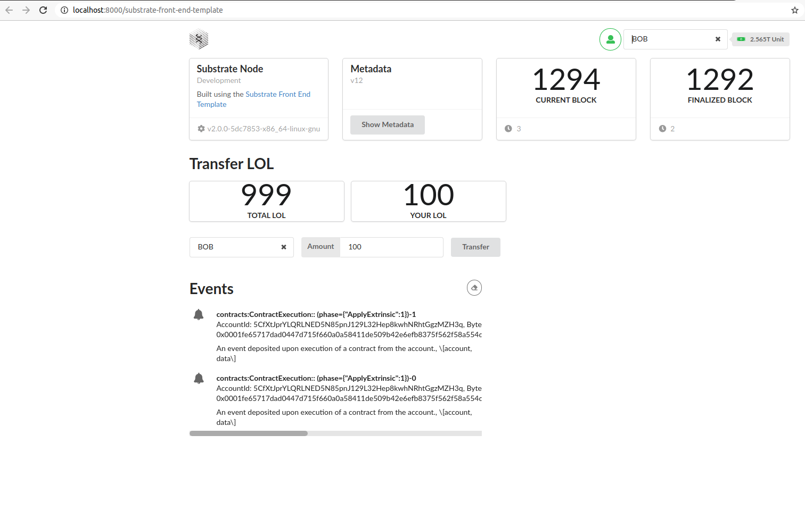

The node repo link is :https://github.com/master-davidlee/substrate-node-template

The ui repo link is:https://github.com/master-davidlee/substrate-front-end-template

The contract link is:https://github.com/master-davidlee/hello-world-by-polkadot/tree/main/Erc20/LOL

The token symbol is LOL, Total supply is 999.            

The screeen shoot,Bob_stash has all the 999,he send alcie 10,and send BOb 100.

